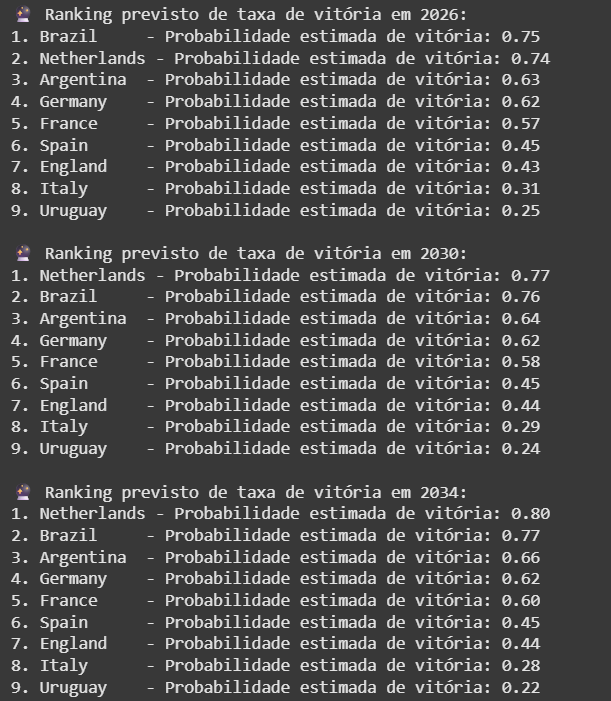
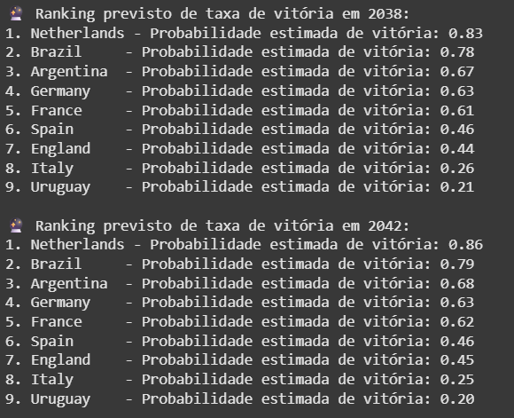
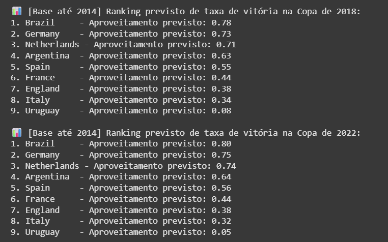
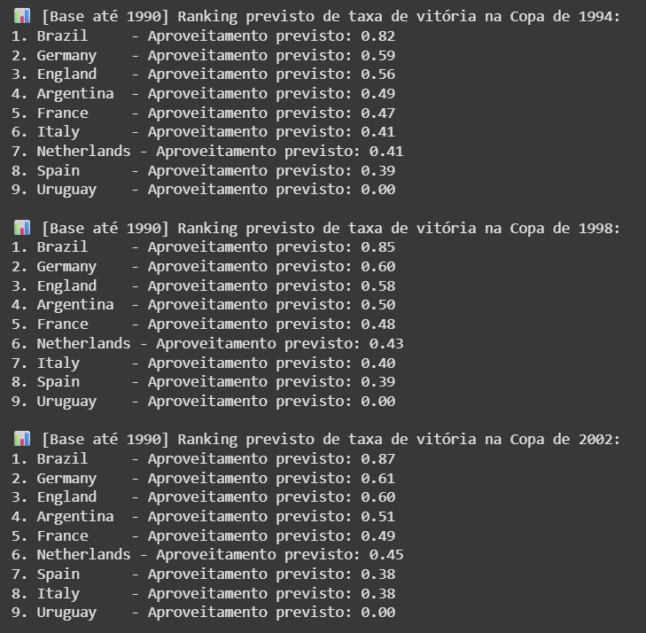
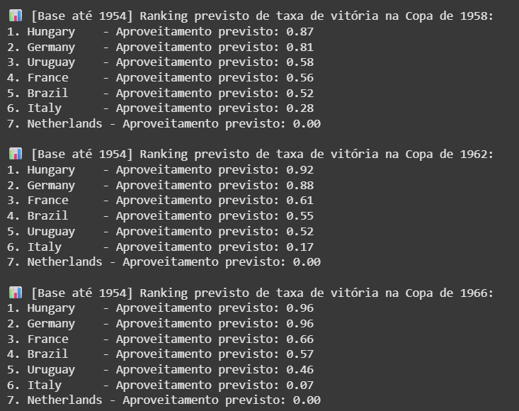
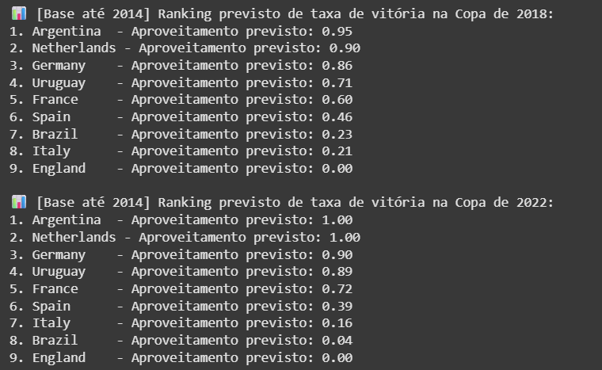
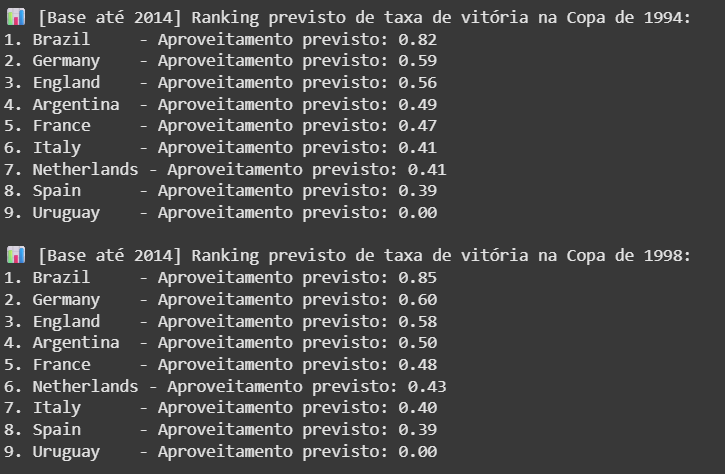

# Projeto Copa do Mundo
##	Introdução
Na Copa do Mundo de 1990, disputada na Itália, o jogo de semifinal Alemanha x Inglaterra colocou de frente duas das melhores seleções da época para rivalizarem em uma partida equilibradíssima. Os alemães levavam a classificação de maneira extremamente apertada, até que a geração de ouro inglesa se recuperou da iminente derrota com um gol no final do jogo. Pós prorrogação, a Alemanha saiu classificada na disputa por pênaltis: 4x3. Saindo de campo desolado, o autor do gol de empate e astro inglês Gary Lineker, ao ser questionado o porquê da não classificação, explicou com uma frase que ecoaria por muito tempo na cabeça dos fãs de futebol: “Football is a simple game. Tweenty-two men chase a ball for 90 minutes and at the end, the germans always win.” (Numa tradução próxima seria: “Futebol é um jogo simples. Vinte e dois homens correm atrás de uma bola por 90 minutos e, no fim, os alemães ganham.”). Essa frase resume muito bem o espanto do mundo do futebol com a capacidade das seleções da Alemanha ao longo do tempo de desempenharem incrivelmente bem em Copas do Mundo. Eu escutei essa frase por volta de 2020 e achei sensacional, sempre a utilizando quando se demonstra viável e adequada. Dessa maneira, achei interessante, dada a oficina elaborada pelo professor João Paixão, se seria possível averiguar a crença de Gary Lineker a partir da matemática e da computação.

##	Dataset
O dataset utilizado foi encontrado no Kaggle e contêm um apanhado de informações, mais especificamente: posição de classificação, partidas, time, vitórias, empates, derrotas, gols pró, gols contra, diferença de gols e pontuação, acerca de todas as seleções participante de cada Copa do Mundo em todas as 22 edições disputadas ao longo da história. 

Link: https://www.kaggle.com/datasets/iamsouravbanerjee/fifa-football-world-cup-dataset/data

Alguns exemplos:

## Detalhes da confecção do projeto
A fim de determinar se o postulado de Lineker (vamos chamar assim, para dar um ar mais intelectual) se traduzia em números e na computação, pensei em evoluir o projeto para verificar se a análise matemática e computacional tinha lastro na opinião de especialistas na área e, assim, foi decidido elaborar um modelo que, analisando os dados do dataset, previsse o desempenho de alguns times em copas no futuro. As seleções escolhidas foram as 8 campeãs mundiais ao longo da história (Brasil, Itália, Alemanha, Argentina, Uruguai, França, Espanha e Inglaterra) + a Holanda, sob o pretexto de que é a única seleção a disputar 3 finais de copa e não ser campeã mundial. O modelo calcularia o desempenho a partir de uma Regressão Linear, que teria como base a taxa de desempenho (vitórias/partidas) dessas seleções por edição nos mundiais anteriores e, então, prediria um desempenho aproximado para os mundiais seguintes. A linguagem utilizada para criação do programa foi o Python e no final, o programa gera um ranking das seleções de acordo com o seu desempenho previsto para o mundial em questão. 

Carregando os arquivos CSV (como é possível ver no Kaggle, é um arquivo por edição de mundial):	

Modelo da Regressão Linear: 

A priori, a intenção do programa era checar como a computação e a matemática preditam a respeito do futebol e se tem algum lastro próximo à realidade, seja por resultados recentes, gerações de jogadores promissoras ou não ou até mesmo pelo postulado de Lineker. Dessa forma o programa inicialmente preveria o desempenho das seleções escolhidas até o ano de 2042, escolha calcada na previsão de que será a última copa de Lamine Yamal, o grande expoente geracional de talento atualmente, sendo assim, teríamos um campo amostral de análise mais palpável de se comparar as predições matemáticas da máquina com as humanas. 

Caso 1:

É interessante perceber que a máquina não prevê nada muito espetacular para Espanha, França e Inglaterra, as seleções tidas como tendo as melhores gerações de jogadores para os próximos 15 anos. Mas, em contrapartida, a sua visão acerca da Itália bate razoavelmente com a dos especialistas e com os resultados recentes da mesma, ambos indicando uma vertiginosa queda e ostracismo da imponente seleção Azurra. Enquanto isso, percebe-se como a Holanda é extremamente bem quista nesse modelo, provavelmente fruto da sua extrema constância nos mundiais. 

Depois, ao consultar o professor João, ele me comunicou que seria melhor para o projeto não calcar a análise comparativa entre máquina vs homem em eventos futuros. Tive como ideia para alteração do programa, dado que a ideia para o projeto surgiu em razão dos alemães, restringir os dados só até 2014, quando foram campeões, e ver o cálculo de desempenho deles para as copas seguintes: 2018 e 2022, nas quais eles foram eliminados ainda na primeira fase.

Caso 2:

Aqui, o modelo já apresenta “erros” bem consistentes, especialmente no que tange a seleção alemã nas duas copas, pois o programa prevê um desempenho alto, enquanto que na realidade a Alemanha não conseguiu passar da fase de grupos em nenhumas das duas edições. Outros pontos interessantes de inconsistência com a realidade é o desempenho regular mediano da França para os dois mundiais, e na realidade ela bateu final nas duas edições e saiu campeã em 2018, inclusive, e o caso da Holanda em 2018 que tem seu desempenho previsto como bem positivo, mas ela sequer participa da copa – tal qual a Itália, que ainda fica fora de 22 também. É uma limitação do programa pois ele não conseguiria nas suas atuais configurações prever isso já que não tem acesso aos dados das eliminatórias para a Copa do Mundo.

A partir dai, é possível brincar bastante com o programa, alterando o período de análise do dataset para ver o quanto ele bate com a realidade já posta.

Aqui, vai mais um exemplo, agora limitando o dataset até os anos 90.

Caso 3: 

O modelo prevê corretamente um alto desempenho da seleção brasileira, que veio se comprovar com essa geração batendo 3 finais seguidas de mundial. Esperava uma previsão mais proeminente para Argentina e Alemanha, dado que são as seleções finalistas da últimas 2 edições que esse dataset vai abarcar (1986 e 1990). No entanto, percebe-se a influência da geração do Gary Lineker para as previsões a respeito da Inglaterra, que passaram longe de se comprovarem, uma vez que a Inglaterra, por exemplo, sequer disputa a edição de 94. Mas, como já tido, não tem como esse modelo calcular isso.

Outro caso que pensei para análise foi restringir o dataset para os primórdios da Copa do Mundo, lá nos anos 50 e ver como o programa vai interpretar o mundo do futebol daquela época, tão diferente do atual.

Caso 4 (até 1954):

Aqui, foi adicionada a Hungria ao seleto grupo de análise, pois os anos 50 são os anos dourados da Hungria no futebol: o melhor jogador do mundo era húngaro (Ferenc Puskas) e sua participação no mundial de 54 é histórica, goleando a Alemanha – que viria a ser campeã na mesma edição - na fase de grupos por 7x2 e abrindo 2x0 na final contra os próprios alemães e não se sagra campeã pois toma uma virada histórica e extremamente dolorida para o coração do povo húngaro. É interessante notar como aqui, por mais que erre consideravelmente as previsões futuras, o programa gera um recorte quase que preciso daqueles que eram, para os especialistas e com base nos resultados desportivos, os melhores esquadrões do futebol mundial por seleções: Hungria, Alemanha e França, nessa ordem.

## Problemas, Possíveis Melhorias e Comentários

O primeiro grande problema reparado no projeto foi o já apontado na seção acima, que me fez ir do Caso 1 para o Caso 2, no qual a análise comparativa de opiniões não deveria ser feita para eventos futuros e, sim, para eventos já realizados. Então, a saída foi reduzir o dataset para as predições da máquina serem feitas para eventos que já passaram. 

O segundo grande problema foi detectado no Caso 3, pois ao reduzir o dataset até 1990, a Alemanha tinha um aproveitamento previsto de ZERO porcento, o que estava extremamente alheio da realidade, uma vez que a Alemanha tinha sido finalista em 4 das últimas 5 edições de Copa. Quando fui analisar o dataset para ver se tinha alguma discrepância nele, percebi que a Alemanha, dos anos 50 até os anos 90, é registrada no dataset como West Germany ou East Germany e não como Germany, em razão da divisão alemã pela cortina de ferro durante a Guerra Fria. A saída foi fazer uma leve alteração no código para sempre que se identificar um West Germany, ele ser identificado como Germany. Optei só pelo West Germany, pois os especialistas identificam a Alemanha Ocidental como a mais próxima do que era a Alemanha de fato no futebol e assumir a Oriental também causaria discrepâncias para a Alemanha em comparação com as outras seleções, pois há edição em que as duas jogaram – 1974, por exemplo, na qual se enfrentaram, inclusive.

Um último comentário a respeito do modelo, é um que eu desenvolvi ao perceber o aproveitamento do Uruguai no Caso 3. Neste caso, o Uruguai tem um desempenho previsto de zero. É muito estranho, tal qual o caso da Alemanha, mas não há no caso uruguaio o uso de um nome diferente da versão inglesa no dataset. Analisando o dataset, percebi que, após a edição de 1970 até a edição de 1990, nas 5 edições que ocorreram nesse período, ou o Uruguai não esteve presente ou quando esteve, teve um desempenho de 0% ou muito próximo disso, o que enviesou todo o modelo para baixo. Não há muito o que consertar, dado que o modelo interpretou corretamente a tendência de vertiginoso declínio técnico uruguaio.

A última correção implementada no programa foi pensada a partir do Caso 4. Analisando-o, fiquei muito impressionado como ele gerou uma análise precisa dos principais times de futebol – que disputavam as copas - da época. Então, tive a ideia de não só restringir até onde o dataset vai no programa, mas aonde ele começa também, então teriamos análises mais precisas sobre determinados recortes temporais.

Caso 5 (Século XXI – até 2014):

Perceba que o modelo prevê corretamente a ascensão da Argentina e acerta o declínio brasileiro em relação à geração campeã do mundo em 2002. Contudo, ele erra consideravelmente na Alemanha (colher de chá aqui, pois nem os próprios especialistas previam um declínio tão acentuado dos alemães) e os números de aproveitamento estão completamente fora da realidade, muito provavelmente por ser um dataset mais enxuto, logo, distorções são mais presentes.

Caso 6 (recorte de 1978-1990):

Aqui, o modelo acerta em cheio, demonstrando os que, nessa época, eram sem dúvidas as melhores gerações do período: Brasil, Alemanha, Inglaterra, Argentina e França (errando só talvez na ordem, mas ai há discordância entre os próprios especialistas, pois muitos apontam que as melhores seleções à época eram a Alemanha de Matthaus e a Argentina de Maradona, que rivalizaram em duas finais de copa consecutivas, mas muitos veem, incluindo o próprio Pep Guardiola, por exemplo, a geração brasileira de Zico, Careca, Sócrates e Falcão como um dos melhores times da história do esporte).

## Conclusão

Diante de todos os dados e análises feitas, é bem razoável concluir que modelos matemáticos e computacionais no geral são defasados e incompletos, principalmente, uma vez que por mais que se incremente mais e mais o seu repertório de dados, vai sempre faltar um componente que é praticamente aleatório e imprevisível para a máquina: o fator humano. A Hungria em 54 era o melhor time do mundo, se provou melhor que todos os seus adversários durante o mundial, mas por detalhes de um jogo de 90 minutos, não foi campeã. O modelo acertou na análise, por mais que o resultado final “desminta” ele. A geração brasileira dos anos 80 era dita como a maior junção de craques imaginável, possivelmente imbatível, mas cai nas quartas de final com o seu melhor jogador perdendo um pênalti diante de uma também excelente França comandada pelo craque Platini que sequer conseguiu alcançar a final. Em 82, igualmente considerados como os melhores, perdemos para uma mais modesta Itália numa noite mágica do ótimo Paolo Rossi, no que ficou conhecido como o Desastre de Sarrià. O modelo, em ambos os casos, previu corretamente que o Brasil era melhor, mas como ele vai calcular essas imponderabilidades? A própria Argentina em 2022, que como vimos no Caso 5 o modelo apontando ela como a provável campeã dessa edição, precisou de uma defesa histórica do seu goleiro no último minuto de jogo para alcançar a glória. O modelo esteve por um chute de errar. Por isso que acertos e erros são muito relativos nos esportes aonde o principal componente é o humano. São seres humanos ali, que tem dias bons, ruins, que se sentem felizes, confiantes, tristes, incapazes, que em cada disputa e em cada corrida estão com o peso e as cicatrizes de suas próprias vidas ali. 

Foi uma experiência muito engrandecedora e prazerosa realizar esse trabalho, unindo duas áreas que eu gosto muito: o futebol (desde sempre) e a surpreendente área de Análise de Dados, a qual não esperava que fosse receber tão bem comigo mesmo. Me permitiu ampliar meus horizontes e minhas percepções a respeito da vida e dessas duas áreas, das quais uma sempre tive um carinho muito grande e da outra descobri, durante esse projeto inclusive, esse maior apreço.

Renzo Luis Damasceno Pereira
