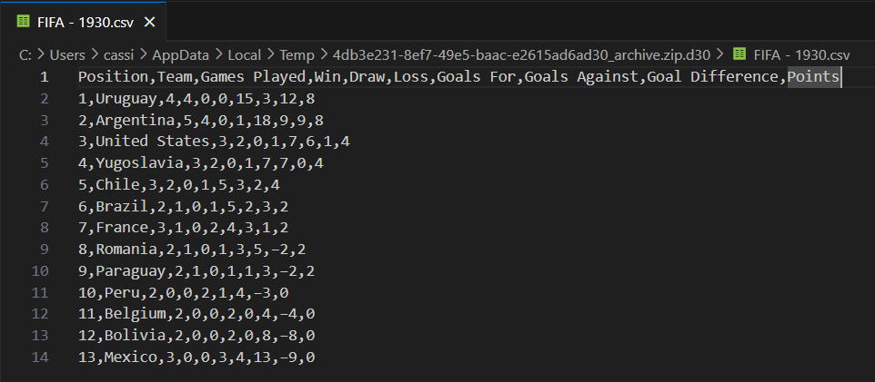
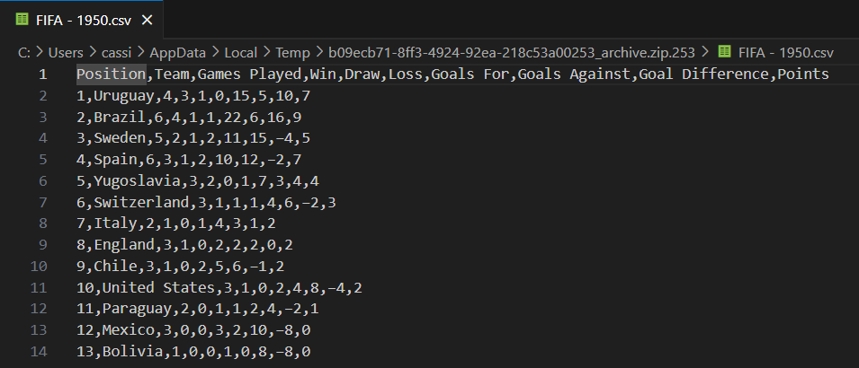
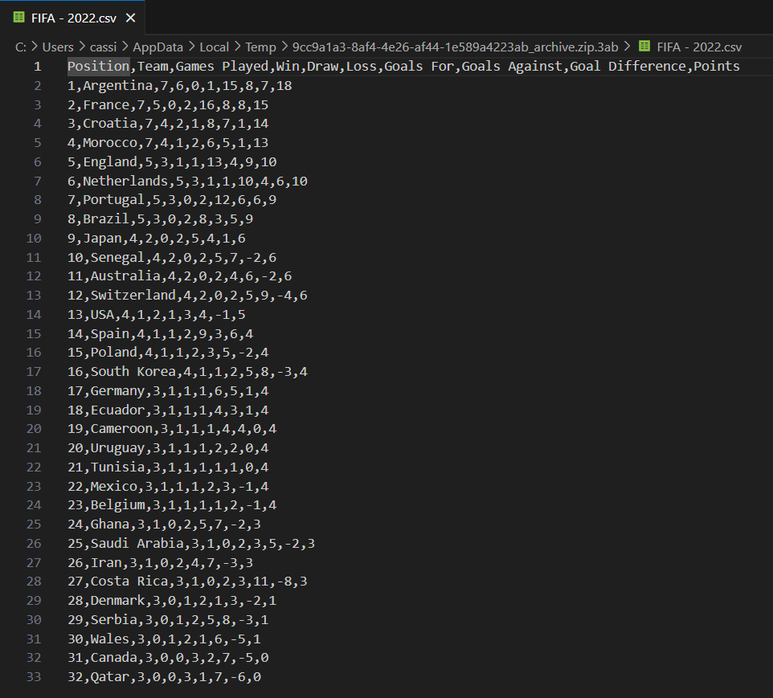
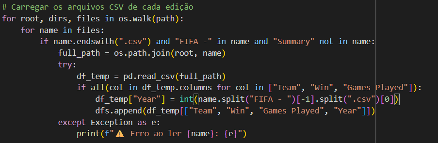
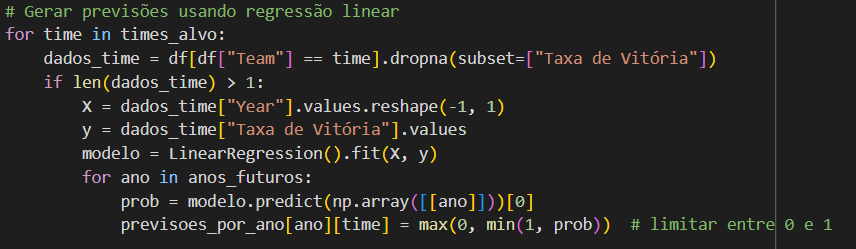

# Projeto Copa do Mundo
##	Introdução
Na Copa do Mundo de 1990, disputada na Itália, o jogo de semifinal Alemanha x Inglaterra colocou de frente duas das melhores seleções da época para rivalizarem em uma partida equilibradíssima. Os alemães levavam a classificação de maneira extremamente apertada, até que a geração de ouro inglesa se recuperou da iminente derrota com um gol no final do jogo. Pós prorrogação, a Alemanha saiu classificada na disputa por pênaltis: 4x3. Saindo de campo desolado, o autor do gol de empate e astro inglês Gary Lineker, ao ser questionado o porquê da não classificação, explicou com uma frase que ecoaria por muito tempo na cabeça dos fãs de futebol: “Football is a simple game. Tweenty-two men chase a ball for 90 minutes and at the end, the germans always win.” (Numa tradução próxima seria: “Futebol é um jogo simples. Vinte e dois homens correm atrás de uma bola por 90 minutos e, no fim, os alemães ganham.”). Essa frase resume muito bem o espanto do mundo do futebol com a capacidade das seleções da Alemanha ao longo do tempo de desempenharem incrivelmente bem em Copas do Mundo. Eu escutei essa frase por volta de 2020 e achei sensacional, sempre a utilizando quando se demonstra viável e adequada. Dessa maneira, achei interessante, dada a oficina elaborada pelo professor João Paixão, se seria possível averiguar a crença de Gary Lineker a partir da matemática e da computação.

##	Dataset
O dataset utilizado foi encontrado no Kaggle e contêm um apanhado de informações, mais especificamente: posição de classificação, partidas, time, vitórias, empates, derrotas, gols pró, gols contra, diferença de gols e pontuação, acerca de todas as seleções participante de cada Copa do Mundo em todas as 22 edições disputadas ao longo da história. 

Link: https://www.kaggle.com/datasets/iamsouravbanerjee/fifa-football-world-cup-dataset/data

Alguns exemplos:

## Detalhes da confecção do projeto
A fim de determinar se o postulado de Lineker (vamos chamar assim, para dar um ar mais intelectual) se traduzia em números e na computação, pensei em evoluir o projeto para verificar se a análise matemática e computacional tinha lastro na opinião de especialistas na área e, assim, foi decidido elaborar um modelo que, analisando os dados do dataset, previsse o desempenho de alguns times em copas no futuro. As seleções escolhidas foram as 8 campeãs mundiais ao longo da história (Brasil, Itália, Alemanha, Argentina, Uruguai, França, Espanha e Inglaterra) + a Holanda, sob o pretexto de que é a única seleção a disputar 3 finais de copa e não ser campeã mundial. O modelo calcularia o desempenho a partir de uma Regressão Linear, que teria como base a taxa de desempenho (vitórias/partidas) dessas seleções por edição nos mundiais anteriores e, então, prediria um desempenho aproximado para os mundiais seguintes. A linguagem utilizada para criação do programa foi o Python e no final, o programa gera um ranking das seleções de acordo com o seu desempenho previsto para o mundial em questão. 

Carregando os arquivos CSV (como é possível ver no Kaggle, é um arquivo por edição de mundial):	

Modelo da Regressão Linear: 

